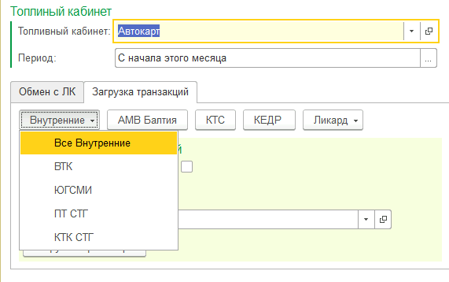

# Задачи
## Вопросы и проблемы полученные на конференции 29.09.2020 г.
- [Обмен данными, ошибки при загрузке транзакций.](#Обмен-данными-и-загрузка-транзакций)
- [Полная перезагрузка транзакций с удалением данных в статусе "Запрос"](#Полная-перезагрузка-транзакций)
- [Расхождение в статусах карт и лимитах](#Расхождение-в-статусах-карт-и-лимитах)
- Не корректно происходит разблокировка при пополнении счета клиентом
- Блокировка одного вида топлива у бюджетных клиентов (ограничение по контракту)
- Смена лимита по эмитенту СТГ
- Контроль блокировки по сумме договора
- Нужна кнопка блокировки в договоре

## Исправление и изменения
### Обмен данными и загрузка транзакций
Переработана система загрузки транзакций.
- Добавлены фоновые процессы, которые каждые 5 минут запускаются, происходит загрузка транзакций за текущие сутки.
- Каждый день в 04:00 происходит полная выгрузка данных, с очисткой накопленных данных, в кабинет клиента.

Переработана форма ручной загрузки транзакций.
Добавлена возможность загрузки транзакции по отдельным эмитентам.

### Полная перезагрузка транзакций
Каждую ночь, в 23:45 запускается задача которая загружает транзакции за месяц с удалением всех накопленных транзакций т.е. происходит полная перезагрузка. *Ликард:* если транзакция в статусе запрос находиться более 1 суток, то не будет.

### Расхождение в статусах карт и лимитах
Для устранения этой проблемы был создан специальный метод сравнения текущего статуса топливной карты с данными в топливном кабинете эмитента. В случае если статусы были различны, то было установлено значение из 1с.
Так же новый метод позволяет сверить лимиты, но запускать его опасно.

### Карты не разблокируются при пополнении при зачислении денег на счет.
Схема механизма блокировки / разблокировки карт была изменена, количество ошибок в заявках было значительно снижено, но к сожалению ошибки еще остались.
Решением этой проблемы, будет внедрение очередей сообщений между топливной системой и эмитеном.

### Блокировка одного вида топлива у бюджетных клиентов
Добавлен новый функционал блокировки вида топлива.
Описание работы:
В контракте указаны несколько видов топлива, в случае если клиент выбирает хоть один вид топлива, автоматически создается документ смена статуса, в который записываются все карты, выданные под этот контракт и то топливо, остаток которого равен 0, блокируется. Остальные виды топлива разрешенные контрактом остаются активны и доступны для потребления.

#### Пример:
У клиента открыты 2 вида топлива
- Дизельное топливо - 1000 литров, остаток 0
- АИ-92 - 400 литров, остаток 200
После блокировки, на всех картах будет изменен лимит на дизель в 0 литров, фактически, топливо, будет не доступно для потребления.

### Смена лимита по эмитенту СТГ
Изменен набор видов топлива для установки лимитов.
- Дизельное топливо
- Регуляр 92
- Пермиум 95
- Супер 98
- СУГ
- AdBlue
Введено ограничение по данному эмитенту.

### Контроль контрактов с ограничением по сумме

